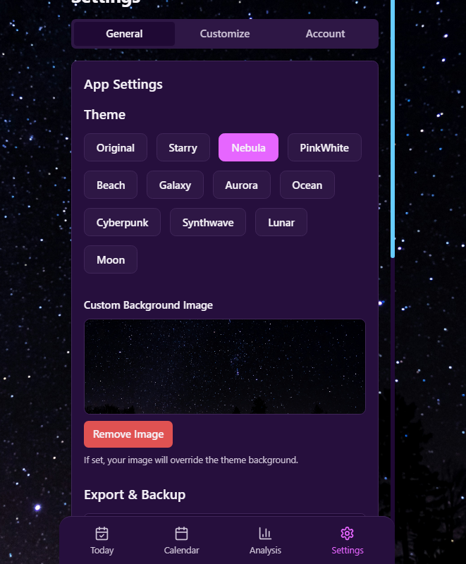
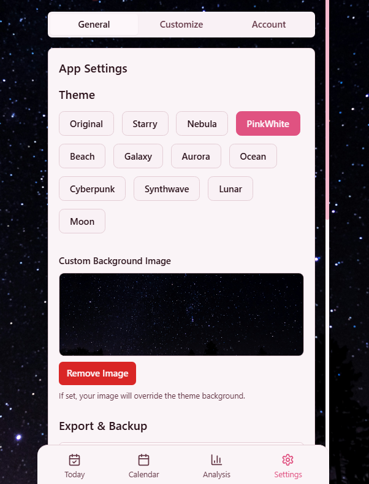
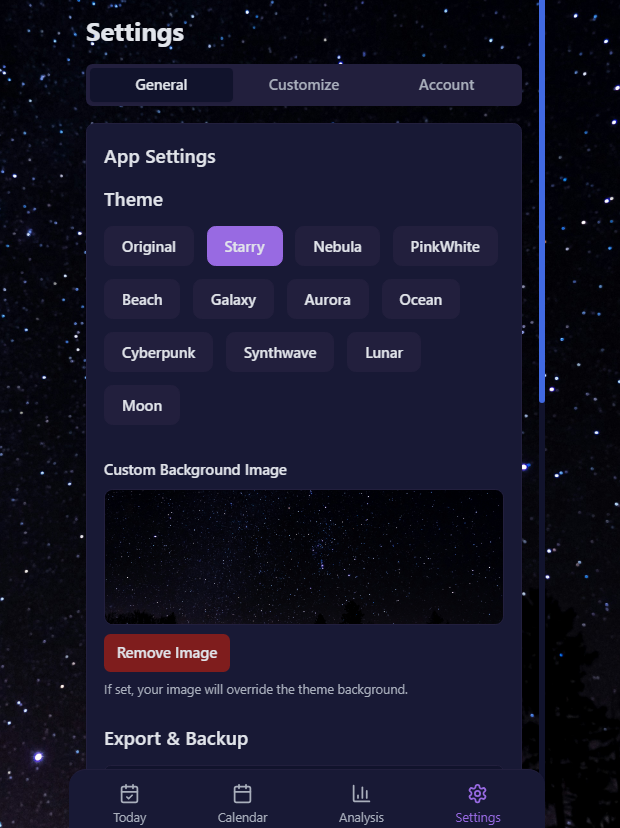
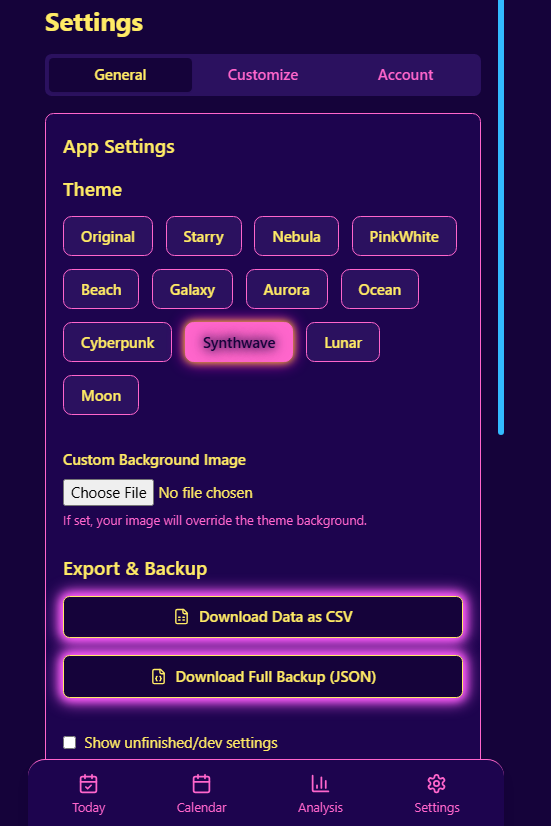

# CycleSense

A local-first, privacy-focused menstrual and PMDD symptom tracker designed for people who want control over their data—without subscriptions, logins, or third-party tracking.

- Track mood, symptoms, medications, and cycle data with full customization
- Export your data as CSV or JSON for personal use or analysis
- Run as a standalone desktop app or in a browser/server mode for flexibility
- Stay 100% offline—your data never leaves your device

This app was created to meet a real-life need for autonomy in health tracking, especially for those managing complex conditions like PMDD. It's functional, user-friendly, and deeply personal.

## Quick Start for All Users

### 1. Downloading the App

#### Option A: Download ZIP from GitHub
- **Download:** Click the green "Code" button on GitHub and select "Download ZIP".
- **Unzip:** Extract anywhere (Desktop, USB drive, etc.).
- **Continue with 'Install Dependencies' below.**

#### Option B: Clone the Repository
- **Install [Git](https://git-scm.com/)** if you don't have it.
- **Open a command prompt in the desired folder and run:**
  ```
  git clone https://github.com/sammeh543/CycleTrackApp.git
  ```
- **Navigate into the folder if you haven't already:**
  ```
  cd CycleTrackApp
  ```
- **Continue with 'Install Dependencies' below.**

### 2. Install Dependencies (Required for ZIP and Clone)
- **Install [Node.js](https://nodejs.org/) (version 14 or higher)** if you don't have it.
- **Open a command prompt in the project folder and run:**
  ```
  npm install
  ```
  This will install Electron and all required packages. You only need to do this once (or after updating dependencies).


### A. Run as Portable Windows App (No Network Needed)
- **Build the EXE:**
  - Double-click `MakePortableExe.bat` (or run `npm run build` then `npm run dist` from the command line).
  - This will create a portable EXE in the `dist` folder.
  - **Note:** If you delete the `dist` folder and rebuild, a new `dist` will be created.
- **Run the App:**
  - Open `dist` and double-click `CycleSense.exe`.
  - **Shortcut:** Make a shortcut to `CycleSense.exe` in the root for convenience. Must keep exe in `dist` folder.
  - All data is stored locally in the `data` folder (this folder is included in the project by default).

### B. Run as Server/Web App (Network Mode)
- **Start the Server:**
  - Double-click `start-broswer-prod.bat` for browser mode (good for use from other devices on your network).

  - Or use `start-CycleSense.bat` for Electron desktop (production mode, no hot reload, on your PC only).
- **Access from Browser/Network:**
  - Only `start-broswer-prod.bat` allows access from other devices on your network (e.g., your phone). Use this for network/server mode.
- **Note:** Running in server/web mode requires Node.js and npm to be installed and dependencies to be installed (see above).

---

## What Gets Installed and When
- **You only need Node.js and npm to build or run the app from source.**
- **You do NOT need to install Electron manually.** It's installed automatically with `npm install`.
- **If you only use the portable EXE:** No Node.js, npm, or Electron install is needed on your PC after building.

---

## Quick Reference
- **Build app after making changes:** `npm run build`
- **Run browser dev server:** `start-broswer-dev.bat`
- **Run Electron dev (hot reload):** `start-CycleSense-dev.bat`
- **Run Electron prod (no reload):** `start-CycleSense.bat`
- **Build portable EXE for distribution:** `MakePortableExe.bat`

---

## Data Storage & Privacy
- All data is stored locally in the `data` folder by default.
- No data is sent to external servers.
- You can export, backup, and restore your data at any time via the app settings.

---

## Features

- **Cycle Tracking**: Monitor your menstrual cycle with phase calculations
- **Symptom Logging**: Track physical and emotional symptoms with customizable intensity
- **Medication Tracking**: Keep track of medications and supplements
- **Calendar View**: Visualize your cycle, symptoms, and fertility window
- **Data Analysis**: View statistics about your cycle and symptom patterns
- **Customizable**: Add custom symptoms and hide default ones that aren't relevant to you
- **Theme Support**: Choose from multiple color themes (Ocean, Beach, Starry, etc.)
- **Local Storage & Privacy**: All data is stored locally on your device for privacy
- **Robust Export/Import**: Export your data as CSV or JSON, and restore from backup via import in Settings

## Getting Started

The application stores all your health information locally in the included `data` folder.

### Configuration (Web/Server Mode Only)

You can customize the application settings by editing the `config.json` file:

```json
{
  "dataPath": "./data",  // Where your data will be stored
  "port": 5000,          // The port the app will run on
  "logLevel": "info",    // Logging detail level
  "backupInterval": 24,  // How often backups are made (hours)
  "maxBackups": 7        // Maximum number of backups to keep
}
```

## Using the Application
Screenshots are available in the [Screenshots](#screenshots) section.

### Today View

- Period status (spotting, light, medium, heavy)
- Mood
- Cervical mucus type
- Physical symptoms
- Emotional symptoms
- PMDD symptoms (for those who track)
- Medications
- Intimate activity (for those who track)
- Daily notes
- PMDD and Intimacy can be toggled on/off in Settings

### Calendar View

- Period days (red)
- Follicular phase (yellow)
- Ovulation/fertile window (blue)
- Luteal phase (purple)
- Days with recorded symptoms

### Analysis View

- Average cycle length
- Average period length
- Common symptoms
- Pattern detection

## PMDD Symptoms Toggle

- You can now choose whether to show or hide PMDD symptoms in the "Today" view via a toggle in App Settings.
- This preference is saved and persists across sessions and restarts.

### Intimacy Toggle

- You can now choose whether to show or hide Intimacy in the "Today" view via a toggle in App Settings.
- This preference is saved and persists across sessions and restarts.

## Data Export, Backup, and Restore

- Go to **Settings → Export & Backup** to download your data as CSV (for Excel) or a full JSON backup.
- To restore your data, use the **Import Backup (JSON)** option in Settings and select your backup file. 
 - HIGHLY RECOMMENDED TO RESET DATA BEFORE IMPORT TO AVOID BUGS
- All data stays on your device unless you choose to export it. No external servers are used.

## Privacy

This application values your privacy:
- All data is stored locally on your device
- No data is sent to external servers
- You control your data: export, backup, and restore at any time


## Network Access & IP Whitelisting (Web/Server Mode)

You can access the app from other devices (like your phone) on the same WiFi network.

### How to Find Your PC’s IP Address

- **Windows:**
  1. Press `Win + R`, type `cmd`, and press Enter to open Command Prompt.
  2. Type `ipconfig` and press Enter.
  3. Look for the `IPv4 Address` under your active network adapter (e.g., `192.168.1.70`).

- **Mac/Linux:**
  1. Open Terminal.
  2. Type `ifconfig` (or `ip a` on some Linux systems) and press Enter.
  3. Look for `inet` under your active network (e.g., `192.168.1.70`).

1. In `config.json`, set:
   ```json
   "ipWhitelistEnabled": true,
   "ipWhitelistFile": "./ip-whitelist.txt"
   ```
2. Add each allowed device's IP address to `ip-whitelist.txt` (one per line):
   ```
   127.0.0.1
   ::1
   192.168.1.70   # PC
   192.168.1.99   # Phone
   ```
3. Restart the server for changes to take effect.

---

## Desktop Development

- **Electron Dev Mode:**
  - Use `Start-CycleSense-dev.bat` for live reload and console output in the desktop app (for development/testing on your PC only).
- **Classic Web Dev:**
  - Use `start-broswer-dev.bat` for browser-based hot reload and network access (for development or network/server mode).


## Running in Network/Server Mode

If you want to access CycleSense from your phone or another device on your network:
- Run `start-broswer-prod.bat` (see above for usage).
- Open a browser on your phone to `http://<your-pc-ip>:5000` (replace `<your-pc-ip>` with your PC's IP address).
- All original web/server features are still available when running in this mode.

Otherwise, use `Start-CycleSense.bat` or `Start-CycleSense-dev.bat` for the portable version with no network access.

---

## Advanced
- To change the splash screen, edit `splash.html`.
- To customize Electron’s window or add features, edit `main.cjs`.

---

### Troubleshooting

- If you see a "Forbidden: Your IP is not whitelisted." message, make sure your current device's IP is in `ip-whitelist.txt` and restart the server.
- For import/export issues, always reset data before importing a backup.
- If the Electron app window is blank, wait a few seconds for the server to start.
- If you see errors, check the terminal for details.
- I can't offer much help but you can always ask AI lol.

### AdditionalTroubleshooting

- **If you see errors about missing Node.js or npm:** Install them from https://nodejs.org
- **If you see errors about missing dependencies:** Run `npm install` in the project folder.

### Port & Process Cleanup (If you see 'port in use' errors)
If you see an error like `Error: listen EADDRINUSE: address already in use` or suspect that Electron/Node processes are stuck, you can use the included cleanup script:

- **Run:** Double-click `cleanup-ports-and-processes.bat` in the project folder. Also built into batch files for starting the app.
- **What it does:** This script will automatically kill any processes using port 5000 (the dev server port) and any lingering Electron/Node processes.
- **When to use:** Before starting the app if you see port errors, or any time you want to ensure a clean state.

---

### Screenshots


### Themes






---

CycleSense  sammeh543. Contributions welcome!
